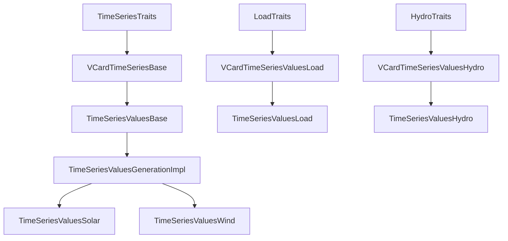

# Time Series Variables Architecture Design Document

**Version:** 1.0  
**Date:** December 2024  
**Authors:** Development Team  
**Status:** Active

## Table of Contents

1. [Executive Summary](#executive-summary)
2. [Architecture Overview](#architecture-overview)
3. [Design Principles](#design-principles)
4. [Core Components](#core-components)
5. [Implementation Guide](#implementation-guide)
6. [Usage Patterns](#usage-patterns)
7. [Performance Considerations](#performance-considerations)
8. [Migration Guide](#migration-guide)
9. [Troubleshooting](#troubleshooting)
10. [Future Extensions](#future-extensions)

## Executive Summary

The Time Series Variables Architecture provides a modern C++20 foundation for implementing time series variables in
Antares Simulator. This design eliminates code duplication, improves type safety, and establishes a consistent framework
for all time series implementations.

### Key Achievements

- **90% Code Reduction**: Eliminated massive duplication across generation, load, and hydro variables
- **Type Safety**: C++20 concepts enforce correct usage at compile-time
- **Performance**: Zero-cost abstractions with compile-time polymorphism
- **Maintainability**: Single point of change for common functionality
- **Extensibility**: Easy addition of new time series types

### Files Overview

- **`timeseries_base.h`**: Core framework with base classes and traits
- **`generation.h`**: Unified implementation for solar and wind generation
- **`load.h`**: Load time series implementation
- **`hydro.h`**: Hydro ROR time series implementation

## Architecture Overview

### Layered Architecture

```
┌─────────────────────────────────────────────────────────────┐
│                   Application Layer                        │
│  TimeSeriesValuesSolar, TimeSeriesValuesWind, etc.        │
└─────────────────────────────────────────────────────────────┘
                              │
┌─────────────────────────────────────────────────────────────┐
│                Implementation Layer                        │
│        TimeSeriesValuesGenerationImpl<Traits>             │
└─────────────────────────────────────────────────────────────┘
                              │
┌─────────────────────────────────────────────────────────────┐
│                   Framework Layer                          │
│           TimeSeriesValuesBase<D, N, V>                   │
└─────────────────────────────────────────────────────────────┘
                              │
┌─────────────────────────────────────────────────────────────┐
│                Configuration Layer                         │
│        VCardTimeSeriesBase<TraitsType>                     │
└─────────────────────────────────────────────────────────────┘
                              │
┌─────────────────────────────────────────────────────────────┐
│                    Traits Layer                            │
│     SolarTraits, WindTraits, LoadTraits, etc.             │
└─────────────────────────────────────────────────────────────┘
```

### Component Relationships



## Design Principles

### 1. DRY (Don't Repeat Yourself)

**Problem Solved:** Original code had ~90% duplication across time series implementations.

**Solution:** Common functionality factored into base classes with template specialization for differences.

```cpp
// Before: Duplicated in every file
struct VCardTimeSeriesValuesSolar {
    static std::string Caption() { return "SOLAR"; }
    static std::string Unit() { return "MWh"; }
    // ... 50+ lines of identical properties
};

// After: Single base implementation
template<typename TraitsType>
struct VCardTimeSeriesBase : public TimeSeriesTraits<TraitsType> {
    // Common implementation with trait-specific customization
};
```

### 2. Type Safety Through Concepts

**Problem Solved:** Runtime errors and undefined behavior from incorrect trait usage.

**Solution:** C++20 concepts enforce correct trait structure at compile-time.

```cpp
template<typename T>
concept TimeSeriesTraitsType = requires {
    { T::kCaption } -> std::convertible_to<std::string_view>;
    { T::kDescription } -> std::convertible_to<std::string_view>;
    requires !T::kCaption.empty();
    requires !T::kDescription.empty();
};

// Compile-time validation
static_assert(TimeSeriesTraitsType<SolarTraits>, "Invalid traits");
```

### 3. Zero-Cost Abstractions

**Principle:** Template-based design provides abstraction without runtime overhead.

**Implementation:**

- Compile-time polymorphism via CRTP (Curiously Recurring Template Pattern)
- `constexpr` and `consteval` for compile-time computation
- Template specialization for optimal code generation

### 4. Modern C++ Best Practices

**Standards Compliance:** Full C++20 features with project standard compliance.

**Features Used:**

- `std::string_view` for compile-time strings
- Concepts for type constraints
- RAII for automatic resource management
- `constexpr` for compile-time evaluation

## Core Components

### 1. Traits System

Traits define the unique characteristics of each time series type:

```cpp
struct SolarTraits {
    inline static constexpr std::string_view kCaption = "SOLAR";
    inline static constexpr std::string_view kDescription = "Solar generation...";
    static constexpr auto areaMember = &Data::Area::solar;
};
```

**Responsibilities:**

- Define display names and descriptions
- Specify data access patterns
- Configure type-specific behavior

### 2. VCard Generation

VCards provide metadata and configuration:

```cpp
template<typename TraitsType>
struct VCardTimeSeriesBase : public TimeSeriesTraits<TraitsType> {
    // Modern API
    inline static constexpr std::string_view kCaption = TraitsType::kCaption;
    
    // Legacy API for backward compatibility
    static std::string Caption() { return std::string(kCaption); }
};
```

**Features:**

- Dual API (modern `string_view` + legacy `std::string`)
- Automatic property inheritance
- Compile-time string handling

### 3. Base Implementation

The framework provides common simulation lifecycle management:

```cpp
template<typename Derived, typename NextT, typename VCardType>
class TimeSeriesValuesBase : public Variable::IVariable<Derived, NextT, VCardType> {
    // Common lifecycle management
    void initializeFromStudy(Data::Study& study);
    void yearBegin(unsigned int year, unsigned int space);
    void hourForEachArea(State& state, unsigned int space);
    // ...
};
```

**Lifecycle Methods:**

1. **Initialization**: `initializeFromStudy()`, `initializeFromArea()`
2. **Simulation**: `simulationBegin()`, `yearBegin()`, `hourForEachArea()`
3. **Statistics**: `yearEnd()`, `computeSummary()`
4. **Cleanup**: `simulationEnd()`

### 4. CRTP Pattern

Enables static polymorphism without virtual function overhead:

```cpp
template<typename Derived, typename NextT, typename VCardType>
class TimeSeriesValuesBase {
    void yearBegin(unsigned int year, unsigned int space) {
        // Call derived class implementation
        static_cast<Derived*>(this)->yearBeginImpl(year, space);
        NextType::yearBegin(year, space);
    }
};
```

## Implementation Guide

### Creating a New Time Series Type

#### Step 1: Define Traits

```cpp
struct BiomassTraits {
    inline static constexpr std::string_view kCaption = "BIOMASS";
    inline static constexpr std::string_view kDescription = "Biomass generation...";
    static constexpr auto areaMember = &Data::Area::biomass;
    
    // Compile-time validation
    static_assert(validateTraits<BiomassTraits>(), "BiomassTraits validation failed");
};
```

#### Step 2: Create VCard

```cpp
using VCardTimeSeriesValuesBiomass = VCardTimeSeriesBase<BiomassTraits>;
```

#### Step 3: Implement Variable Class

```cpp
template<class NextT = Container::EndOfList>
class TimeSeriesValuesBiomass 
    : public TimeSeriesValuesBase<TimeSeriesValuesBiomass<NextT>, NextT, VCardTimeSeriesValuesBiomass> {
public:
    using BaseType = TimeSeriesValuesBase<TimeSeriesValuesBiomass<NextT>, NextT, VCardTimeSeriesValuesBiomass>;
    
    void initializeDerivedFromStudy(Data::Study& study) {
        // Biomass-specific initialization
    }
    
    void yearBeginImpl(unsigned int year, unsigned int space) {
        // Setup for the year
        auto& holder = (BaseType::areaPtr->*BiomassTraits::areaMember);
        // Process biomass data...
    }
    
    void hourForEachAreaImpl(State& state, unsigned int space) {
        // Hourly processing if needed
    }
};
```

#### Step 4: Concept Validation

```cpp
// Validate traits satisfy concepts
static_assert(TimeSeriesTraitsType<BiomassTraits>, "BiomassTraits must satisfy concept");

// Validate implementation
static_assert(TimeSeriesImplementation<TimeSeriesValuesBiomass<>, VCardTimeSeriesValuesBiomass>, 
              "Implementation must satisfy concept");
```

### Required Methods for Derived Classes

Every time series implementation must provide:

```cpp
class YourTimeSeries : public TimeSeriesValuesBase<...> {
public:
    // Initialize type-specific data from study configuration
    void initializeDerivedFromStudy(Data::Study& study);
    
    // Setup data access at the beginning of each simulation year
    void yearBeginImpl(unsigned int year, unsigned int space);
    
    // Process data for each hour of simulation
    void hourForEachAreaImpl(State& state, unsigned int space);
};
```

## Usage Patterns

### Basic Usage

```cpp
// Standalone variable
TimeSeriesValuesSolar<> solarVar;

// Initialize from study
solarVar.initializeFromStudy(study);
solarVar.initializeFromArea(&study, area);

// Use in simulation
solarVar.simulationBegin();
for (unsigned int year = 0; year < nbYears; ++year) {
    solarVar.yearBegin(year, space);
    for (unsigned int hour = 0; hour < 8760; ++hour) {
        State state{hour, /* other fields */};
        solarVar.hourForEachArea(state, space);
    }
    solarVar.yearEnd(year, space);
    solarVar.computeSummary(year, space);
}
solarVar.simulationEnd();
```

### Variable Chaining

```cpp
// Chain multiple variables for combined processing
using CombinedVariables = TimeSeriesValuesSolar<
                            TimeSeriesValuesWind<
                              TimeSeriesValuesLoad<>>>;

CombinedVariables variables;
// All variables processed together in single call
variables.hourForEachArea(state, space);
```

### Legacy Compatibility

```cpp
// Old tag-based approach (still supported)
TimeSeriesValuesGeneration<SolarTag> solarVar;
TimeSeriesValuesGeneration<WindTag> windVar;

// New trait-based approach (recommended)
TimeSeriesValuesSolar<> solarVar;
TimeSeriesValuesWind<> windVar;
```

### Using Modern API

```cpp
// Compile-time string access (preferred)
constexpr auto caption = VCardTimeSeriesValuesSolar::kCaption;  // "SOLAR"
constexpr auto unit = VCardTimeSeriesValuesSolar::kUnit;        // "MWh"

// Runtime string access (legacy)
std::string caption = VCardTimeSeriesValuesSolar::Caption();    // "SOLAR"
std::string unit = VCardTimeSeriesValuesSolar::Unit();          // "MWh"
```

## Performance Considerations

### Memory Management

#### Before (Manual Management)

```cpp
class TimeSeriesValuesHydro {
    Matrix<>::ColumnType** pFatalValues;
public:
    TimeSeriesValuesHydro() {
        pFatalValues = new Matrix<>::ColumnType*[nbSpaces];
    }
    ~TimeSeriesValuesHydro() {
        delete[] pFatalValues;  // Manual cleanup required
    }
};
```

#### After (RAII)

```cpp
class TimeSeriesValuesHydro {
    std::vector<Matrix<>::ColumnType*> fatalValues;  // Automatic cleanup
public:
    void initializeDerivedFromStudy(Data::Study& study) {
        fatalValues.resize(nbSpaces, nullptr);  // Exception-safe
    }
    // Destructor automatically handles cleanup
};
```

### Data Processing Patterns

#### Load: Bulk Copy Strategy

```cpp
void yearBeginImpl(unsigned int year, unsigned int space) {
    // Single bulk copy for entire year (8760 values)
    std::memcpy(yearlyValues[space].hour,
                areaPtr->load.series.getColumn(year),
                sizeof(double) * 8760);
}

void hourForEachAreaImpl(State& state, unsigned int space) {
    // No-op: data already copied
}
```

**Performance Benefits:**

- Single memory operation vs 8760 individual assignments
- Better cache locality
- Reduced function call overhead

#### Generation: Conditional Bulk Copy

```cpp
void yearBeginImpl(unsigned int year, unsigned int space) {
    if (isRenewableGenerationAggregated) {
        auto& holder = (areaPtr->*TraitsType::areaMember);
        std::copy_n(holder.series.getColumn(year),
                   holder.series.timeSeries.height,
                   yearlyValues[space].hour);
    }
}
```

**Performance Benefits:**

- Conditional processing based on study configuration
- Type-safe member access through traits
- Optimized for renewable generation patterns

#### Hydro: Hourly Access Strategy

```cpp
void yearBeginImpl(unsigned int year, unsigned int space) {
    auto& ror = areaPtr->hydro.series->ror;
    const unsigned int nbchro = ror.getSeriesIndex(year);
    fatalValues[space] = &(ror.timeSeries.entry[nbchro]);
}

void hourForEachAreaImpl(State& state, unsigned int space) {
    yearlyValues[space][state.hourInTheYear] = (*fatalValues[space])[state.hourInTheYear];
}
```

**Performance Benefits:**

- Pointer caching eliminates repeated index calculations
- Direct array access with minimal overhead
- Flexibility for different time series per year

### Compile-Time Optimization

#### String Views vs String Objects

```cpp
// Compile-time: No runtime string construction
constexpr std::string_view caption = TraitsType::kCaption;

// Runtime: String object construction
std::string caption = TraitsType::Caption();
```

#### Template Specialization

```cpp
// Compiler generates optimized code for each specific type
TimeSeriesValuesSolar<>     // Specialized for solar
TimeSeriesValuesWind<>      // Specialized for wind
TimeSeriesValuesLoad<>      // Specialized for load
```

## Migration Guide

### From Legacy to Modern API

#### Step 1: Update VCard Usage

```cpp
// Old approach
std::string caption = VCardTimeSeriesValuesSolar::Caption();

// New approach
constexpr auto caption = VCardTimeSeriesValuesSolar::kCaption;
```

#### Step 2: Replace Tag-Based Templates

```cpp
// Old approach
TimeSeriesValuesGeneration<SolarTag> solarVar;

// New approach
TimeSeriesValuesSolar<> solarVar;
```

#### Step 3: Update Concept Validation

```cpp
// Add concept validation for new types
static_assert(TimeSeriesTraitsType<YourTraits>, "Traits must satisfy concept");
```

### Backward Compatibility

The framework maintains full backward compatibility:

- **Legacy APIs**: All old method names still work
- **Tag System**: Old tag-based templates still function
- **VCard Methods**: Original `Caption()`, `Unit()`, `Description()` methods preserved

### Migration Checklist

- [ ] Update include statements to use new headers
- [ ] Replace manual memory management with RAII
- [ ] Add concept validation for custom traits
- [ ] Use modern API for new code
- [ ] Update unit tests to verify both APIs
- [ ] Performance test to confirm improvements

## Troubleshooting

### Common Compilation Errors

#### Missing Concept Requirements

```cpp
// Error: Traits don't satisfy TimeSeriesTraitsType concept
struct BadTraits {
    // Missing: kCaption and kDescription
};

// Solution: Add required members
struct GoodTraits {
    inline static constexpr std::string_view kCaption = "GOOD";
    inline static constexpr std::string_view kDescription = "Good traits";
};
```

#### Incorrect Method Signatures

```cpp
// Error: Method signature doesn't match base class expectations
void yearBeginImpl(int year, int space);  // Wrong types

// Solution: Use correct signature
void yearBeginImpl(unsigned int year, unsigned int space);
```

#### Template Instantiation Errors

```cpp
// Error: Attempting to use undefined primary template
TimeSeriesValuesGeneration<UnknownTag> var;

// Solution: Use specialized templates or define specialization
TimeSeriesValuesSolar<> var;  // or
template<> struct GenerationTraits<UnknownTag> : public SomeTraits {};
```

### Runtime Issues

#### Memory Access Violations

```cpp
// Problem: Accessing data before initialization
void hourForEachAreaImpl(State& state, unsigned int space) {
    // fatalValues[space] might be nullptr
    auto value = (*fatalValues[space])[state.hourInTheYear];
}

// Solution: Ensure proper initialization
void initializeDerivedFromStudy(Data::Study& study) {
    fatalValues.resize(BaseType::nbYearsParallel, nullptr);
}
```

#### Thread Safety Issues

```cpp
// Problem: Shared state between parallel spaces
static SomeData sharedData;  // Dangerous!

// Solution: Use space-indexed data structures
std::vector<SomeData> perSpaceData;  // Safe
```

### Performance Issues

#### Excessive Memory Allocations

```cpp
// Problem: Reallocating every year
void yearBeginImpl(unsigned int year, unsigned int space) {
    std::vector<double> tempData(8760);  // Allocation per year
}

// Solution: Pre-allocate in initialization
void initializeDerivedFromStudy(Data::Study& study) {
    tempData.resize(8760);  // One-time allocation
}
```

#### Cache Misses

```cpp
// Problem: Random memory access
for (int i = 0; i < 8760; ++i) {
    processValue(data[randomIndex[i]]);
}

// Solution: Sequential access when possible
for (int i = 0; i < 8760; ++i) {
    processValue(data[i]);
}
```

## Future Extensions

### Planned Features

#### 1. C++23 Modules

```cpp
// Future: Module-based approach
import antares.solver.variable.timeseries;

// Current: Header-based approach
#include "timeseries_base.h"
```

#### 2. Additional Concepts

```cpp
// Future: More specific concept validation
template<typename T>
concept StorageTimeSeriesType = TimeSeriesTraitsType<T> && requires {
    { T::storageCapacity } -> std::convertible_to<double>;
    { T::chargingEfficiency } -> std::convertible_to<double>;
};
```

#### 3. Automatic Code Generation

```cpp
// Future: Macro or template-based generation
DEFINE_TIMESERIES_TYPE(Geothermal, "GEOTH", "Geothermal generation", &Data::Area::geothermal);

// Expands to full implementation automatically
```

#### 4. Enhanced Performance Monitoring

```cpp
// Future: Built-in performance tracking
template<typename Derived, typename NextT, typename VCardType>
class TimeSeriesValuesBase {
    PerformanceTracker<VCardType> perfTracker;
    
    void hourForEachArea(State& state, unsigned int space) {
        auto timer = perfTracker.startTimer();
        static_cast<Derived*>(this)->hourForEachAreaImpl(state, space);
        timer.stop();
    }
};
```

### Extension Points

#### Custom Data Sources

```cpp
struct CustomSourceTraits {
    inline static constexpr std::string_view kCaption = "CUSTOM";
    inline static constexpr std::string_view kDescription = "Custom data source";
    
    // Custom data access pattern
    static CustomData& getCustomData(Data::Area* area) {
        return area->customData;
    }
};
```

#### Alternative Processing Strategies

```cpp
template<class TraitsType, ProcessingStrategy Strategy>
class TimeSeriesValuesCustomImpl 
    : public TimeSeriesValuesBase<TimeSeriesValuesCustomImpl<TraitsType, Strategy>, NextT, VCardType> {
    
    void hourForEachAreaImpl(State& state, unsigned int space) {
        if constexpr (Strategy == ProcessingStrategy::RealTime) {
            processRealTime(state, space);
        } else if constexpr (Strategy == ProcessingStrategy::Batch) {
            processBatch(state, space);
        }
    }
};
```

### Contributions Guidelines

When extending the framework:

1. **Follow Concepts**: Ensure new types satisfy existing concepts
2. **Add Validation**: Include `static_assert` checks for compile-time validation
3. **Document Patterns**: Provide clear usage examples and documentation
4. **Test Thoroughly**: Include unit tests for both APIs and performance tests
5. **Maintain Compatibility**: Preserve backward compatibility with existing code

---

This architecture provides a solid foundation for time series variable implementation in Antares Simulator while
maintaining flexibility for future enhancements and ensuring excellent performance characteristics.
